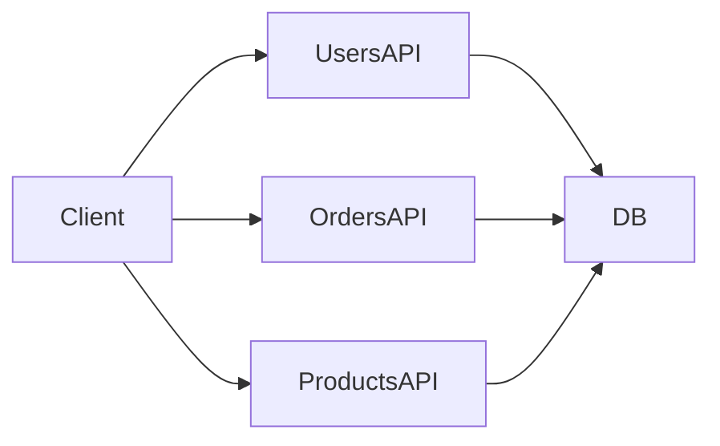
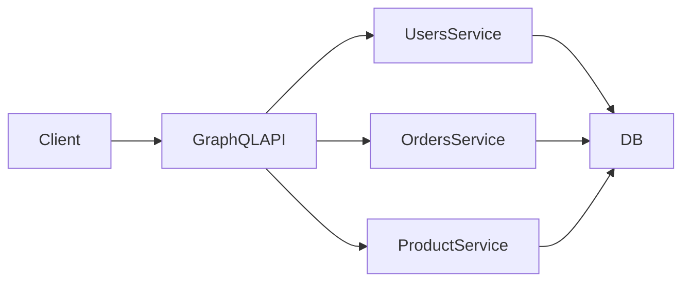
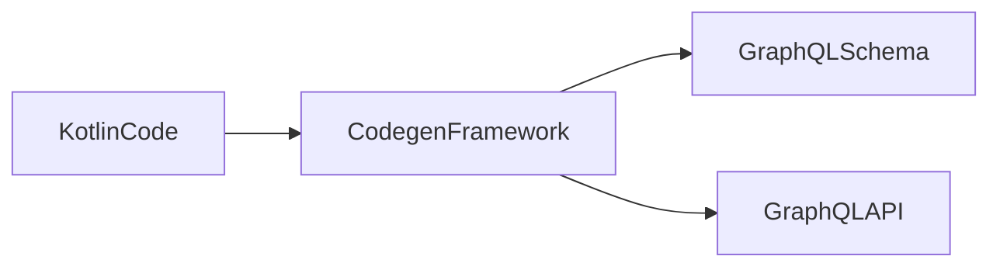
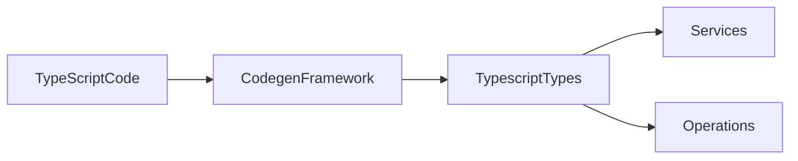

# Codecentric GraphQL

GraphQL Architektur und der Codecentric Ansatz

**Agenda**

1. Was ist GraphQL?
2. GraphQL vs REST
3. Codecentric GraphQL
4. Architektur mit Kotlin und Angular

<!--
Begrüßung und kurze Einführung. Ich erkläre zunächst GraphQL und
die wichtigsten Konzepte, vergleiche es anschließend mit REST und zeige
danach den Codecentric Ansatz mit Kotlin sowie eine Beispielarchitektur.
Abschließend gibt es eine Live-Demo in einer Beispiel-Anwendung.
-->
------------------------------------------------------------------------

# Was ist GraphQL?

GraphQL ist eine **Query-Sprache für APIs**.

Ziel:\
Clients können **genau die Daten anfragen, die sie benötigen**.

Eigenschaften:

- Stark typisiertes Schema
- Ein API Endpoint
- Flexible Datenabfragen
- Ursprünglich von Facebook entwickelt
- Weit verbreitet in modernen Web- und Mobile-Anwendungen
- Adoption rate zwischen 2021 zu 2025 von 10% auf über 50% (
  Quelle: [zylos.ai](https://zylos.ai/research/2026-02-04-graphql-modern-api-development))

<!--
GraphQL ist keine Datenbank, sondern eine API‑Abfragesprache. Der
wichtigste Unterschied zu REST ist, dass der Client bestimmt, welche
Daten zurückgegeben werden.
-->
------------------------------------------------------------------------

# REST vs GraphQL

## REST



Probleme:

- Viele Endpoints
- Mehrere Requests
- Overfetching

<!--
notes: REST APIs bestehen oft aus vielen Endpoints. Clients müssen
mehrere Requests kombinieren und oft sequentiell orchestrieren.
-->
------------------------------------------------------------------------

# GraphQL Ansatz



Vorteile:

- Ein Endpoint
- Flexible Datenabfragen
- Aggregation mehrerer Services über eine Query / Mutation

<!--
GraphQL aggregiert Daten aus verschiedenen Services und liefert
sie über eine einzige Query.
-->
------------------------------------------------------------------------

# Grundbegriffe in GraphQL

<div class="grid grid-cols-2">

<div class="text-sm">

- **Query**: Einstiegspunkt zum Lesen von Daten
- **Mutation**: Einstiegspunkt zum Schreiben von Daten
- **Subscription**: Echtzeit-Updates über WebSockets (nicht relevant in Demo)
- **Fragment**: Wiederverwendbare Datenstruktur für Queries und Mutations

Es gibt noch weitere Begriffe, aber diese sind die wichtigsten für den Einstieg:
- **Object Type**: Strukturierter Typ mit mehreren Feldern
- **Scalar Type**: Einfacher Basisdatentyp für Einzelwerte
- **Enum Type**: Feste Liste erlaubter Werte

**Weiterführend**: [Learn Path von GQL](https://graphql.org/learn/introduction/)

</div>

<div class="overflow-y-scroll h-96 border solid p-1">

```graphql
query GetBook {
  allBooks {
    id
    title
    category
    author {
      name
    }
    reviews {
      rating
      comment
    }
  }
}

fragment BookInput on Book {
  title
  category
  abstract
}

mutation savePerson($book: BookInput!) {
  savePerson(book: $book) {
    id
    title
    category
    abstract
  }
}
```

</div>

</div>

<!--
- Queries lesen Daten
- Mutations verändern Daten.
- Fragmente ermöglichen Wiederverwendung von Datenstrukturen welche in Queries oder Mutations genutzt werden.
- Es gibt noch weitere Begriffe wie etwa Scalar Types und Enum Types, etc.; zunächst nicht relevant
-->

------------------------------------------------------------------------

# Codecentric GraphQL I

Beim **codecentric Ansatz** wird das **GraphQL Schema** aus dem Code
generiert und kann in der **GraphQL API** referenziert werden. Optimalerweise generiert der **Client** wiederum Typen
aus dem Schema, um eine starke Typisierung über die gesamte Kette zu gewährleisten.

## Backend


------------------------------------------------------------------------

# Codecentric GraphQL II

## Frontend


## Vorteile

- Schneller Entwicklungsprozess
- Schema bleibt synchron zum Code
- Starke Typisierung von Backend-Code bis hin zu Clients (andere Services oder Frontend)
- Single Source of Truth => Backend Code => API Schema => Frontend Typen


<!--
- Frameworks generieren das Schema automatisch aus vorhandenen Klassen und Funktionen.
- Schema ist vergleichbar mit Open-API Spec da Sie alle Datentypen und Operationen beinhaltet.
- Wir haben auch Vorteile wie etwa Lazy-Loading per Fragment, aber dazu später mehr.
-->
------------------------------------------------------------------------

# Setup für Demo

<div class="grid grid-cols-2 text-sm">
<div>

Backend:

- **Sprache**: Kotlin
- **BE Server Plattform**: [Ktor](https://ktor.io/)
- **Codegen BE / API Provider GraphQL**: [GraphQL Kotlin Framework](https://opensource.expediagroup.com/graphql-kotlin/docs/)

</div>
<div>

Frontend:

- **Sprache / Framework**: Typescript / Angular
- **GraphQL Client**: [Apollo (Angular)](https://www.apollographql.com/)
- **Codegen FE**: [graphql-codegen](https://the-guild.dev/graphql/codegen)

</div>
</div>

<div class="width-full">

```mermaid
flowchart TB

subgraph Backend
    direction LR
    KotlinCode[Kotlin Code] --> KotlinGraphQL[Kotlin GraphQL Framework]
    KotlinGraphQL --> GraphQLSchema[GraphQL Schema]
    GraphQLSchema --> API
end

subgraph Frontend
    direction LR
    BackendSchema[API Schema] --> Codegen
    Codegen --> GraphQLTypes[GraphQL Types]
    GraphQLTypes --> GQLOperations[GQL Operations]
    GQLOperations --> TypescriptCode[(Angular-)Services]
end

Backend --> Frontend

```

</div>

<!--
- Das Backend generiert automatisch ein Schema, graphql-codegen erzeugt daraus TypeScript Typen für das Angular Frontend.
- Der Codecentric Ansatz eignet sich gut für Backend‑getriebene Schemas
- GraphQL wiederum bietet Client-driven Datenstrukturen für die Schemas des Backends
-->

------------------------------------------------------------------------

# Kotlin GraphQL Framework (Expedia)

Features:

- Kotlin-first
- automatische Schema Generierung
- Ktor oder Spring Integration

``` kotlin
class UserQuery {

    fun user(id: ID): User {
        return userService.findUser(id)
    }

}
```

<!--
notes: Das Expedia GraphQL Framework nutzt Reflection, um Kotlin
Funktionen automatisch als Queries bereitzustellen.
-->

------------------------------------------------------------------------

# GraphQL Live Demo WebApp

<div class="w-full h-full p-1 border solid">
<iframe src="http://localhost:4200" height="95%" width="100%"></iframe>
</div>


------------------------------------------------------------------------

# GraphQL Initiale Daten über GraphIQL Endpunt

<div class="w-full h-full p-1 border solid">
<iframe src="http://localhost:8080/graphiql" height="95%" width="100%"></iframe>
</div>

------------------------------------------------------------------------

# GraphQL Live Demo Schema

<div class="w-full h-full p-1 border solid">
<iframe src="http://localhost:8080/sdl" height="95%" width="100%"></iframe>
</div>

------------------------------------------------------------------------

# Let's look at code

- Backend: Kotlin Code, GraphQL Schema, GraphQL API
- Frontend: TypeScript Code, generierte GraphQL Types und Operations, Angular Services

------------------------------------------------------------------------

# Fazit

**GraphQL bietet:**

- flexible Datenabfragen
- effiziente APIs
- stark typisierte Schnittstellen
- Client getriebene Datenabfrage

**Codecentric GraphQL ermöglicht:**

- schnelle Entwicklung
- automatische Schema Generierung
- starke Typisierung zwischen Backend und Frontend

**Ausblick:** 
- Ansätze GraphQL als Gateway zu nutzen, um verschiedene Services zu aggregieren
- Es gibt eine Art Open-API "Bridge" für GraphQL, um bestehende REST APIs in GraphQL zu integrieren

<!--
Zusammenfassung der wichtigsten Punkte.
-->