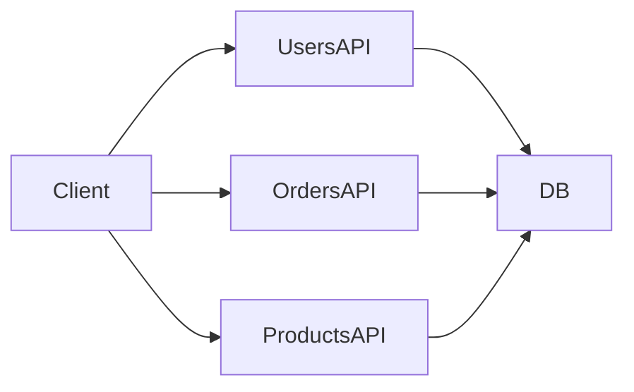
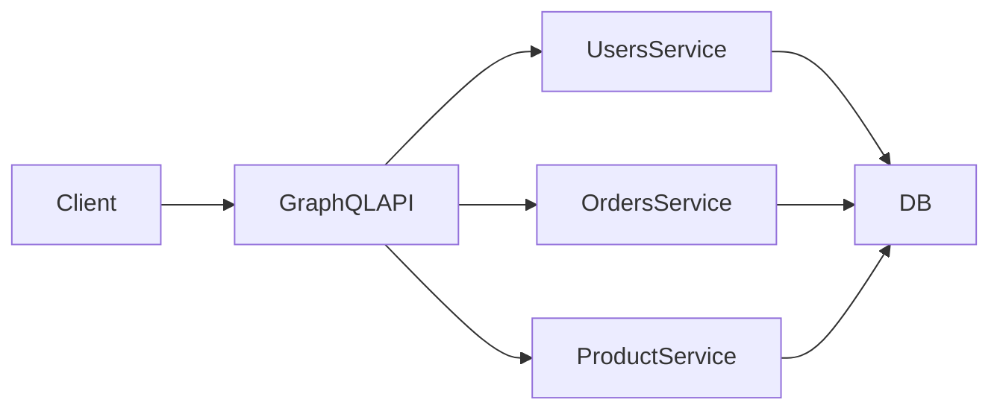
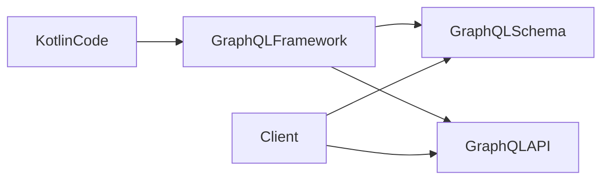

# Codecentric GraphQL

GraphQL Architektur und der Codecentric Ansatz

**Agenda**

1. Was ist GraphQL?
2. GraphQL vs REST
3. Codecentric GraphQL
4. Architektur mit Kotlin und Angular

<!--
Begrüßung und kurze Einführung. Ich erkläre zunächst GraphQL und
die wichtigsten Konzepte, vergleiche es anschließend mit REST und zeige
danach den Codecentric Ansatz mit Kotlin sowie eine Beispielarchitektur.
Abschließend gibt es eine Live-Demo in einer Beispiel-Anwendung.
-->
------------------------------------------------------------------------

# Was ist GraphQL?

GraphQL ist eine **Query-Sprache für APIs**.

Ziel:\
Clients können **genau die Daten anfragen, die sie benötigen**.

Eigenschaften:

- Stark typisiertes Schema
- Ein API Endpoint
- Flexible Datenabfragen
- Selbst dokumentierende API
- Ursprünglich von Facebook entwickelt
- Weit verbreitet in modernen Web- und Mobile-Anwendungen
- Adoption rate zwischen 2021 zu 2025 von 10% auf über 50% (
  Quelle: [zylos.ai](https://zylos.ai/research/2026-02-04-graphql-modern-api-development))

<!--
GraphQL ist keine Datenbank, sondern eine API‑Abfragesprache. Der
wichtigste Unterschied zu REST ist, dass der Client bestimmt, welche
Daten zurückgegeben werden.
-->
------------------------------------------------------------------------
layout: two-columns
---
# Grundbegriffe in GraphQL

::left
- Query Type: Einstiegspunkt zum Lesen von Daten
- Mutation Type: Einstiegspunkt zum Schreiben von Daten
- Object Type: Strukturierter Typ mit mehreren Feldern
- Scalar Type: Einfacher Basisdatentyp für Einzelwerte
- Enum Type: Feste Liste erlaubter Werte
- Interface Type: Gemeinsame Felder für mehrere Typen
- Union Type: Feld kann mehrere Typen zurückgeben
- Input Type: Strukturierter Typ für Eingabeparameter
- List Type: Feld enthält Liste gleicher Typen
- Non-Null Type: Feld darf niemals null sein

::right
```graphql
query GetBook {
  allBooks {
    title
    category
    author {
      name
    }
    reviews {
      rating
      comment
    }
  }
}
```

<!--
- Queries lesen Daten
- Mutations verändern Daten.
- Fragmente ermöglichen Wiederverwendung von Datenstrukturen welche in Queries oder Mutations genutzt werden.
- Es gibt noch weitere Begriffe wie etwa Scalar Types und Enum Types, etc.; zunächst nicht relevant
-->

------------------------------------------------------------------------

# REST vs GraphQL

## REST



Probleme:

- Viele Endpoints
- Mehrere Requests
- Overfetching

<!--
notes: REST APIs bestehen oft aus vielen Endpoints. Clients müssen
mehrere Requests kombinieren und oft sequentiell orchestrieren.
-->
------------------------------------------------------------------------

# GraphQL Ansatz



Vorteile:

- Ein Endpoint
- Flexible Datenabfragen
- Aggregation mehrerer Services über eine Query / Mutation

<!--
GraphQL aggregiert Daten aus verschiedenen Services und liefert
sie über eine einzige Query.
-->
------------------------------------------------------------------------

# Codecentric GraphQL

Beim **codecentric Ansatz** wird das **GraphQL Schema** aus dem Code
generiert und kann in der **GraphQL API** referenziert werden.



Vorteile:

- Schneller Entwicklungsprozess
- Schema bleibt synchron zum Code
- Starke Typisierung von Backend-Code bis hin zu Clients (andere Services oder Frontend)
- Single Source of Truth => Backend Code => API Schema => Frontend Typen

<!--
- Frameworks generieren das Schema automatisch aus vorhandenen Klassen und Funktionen.
- Schema ist vergleichbar mit Open-API Spec da Sie alle Datentypen und Operationen beinhaltet.
- Wir haben auch Vorteile wie etwa Lazy-Loading per Fragment, aber dazu später mehr.
-->
------------------------------------------------------------------------

# Kotlin GraphQL Framework (Expedia)

Features:

- Kotlin-first
- automatische Schema Generierung
- Ktor oder Spring Integration

``` kotlin
class UserQuery {

    fun user(id: ID): User {
        return userService.findUser(id)
    }

}
```

<!--
notes: Das Expedia GraphQL Framework nutzt Reflection, um Kotlin
Funktionen automatisch als Queries bereitzustellen.
-->
------------------------------------------------------------------------

# Codecentric GraphQL Architektur

<div class="grid grid-cols-2">
<div>

Backend:

- Kotlin
- Ktor
- Expedia GraphQL Framework

</div>
<div>

Frontend:

- Angular
- GraphQL Client
- graphql-codegen

</div>
</div>

<div class="width-full">

```mermaid
flowchart TB

subgraph Backend
    direction LR
    KotlinCode --> GraphQLFramework
    GraphQLFramework --> GraphQLSchema
    GraphQLSchema --> API
end

subgraph Frontend
    direction LR
    BackendSchema[API Schema] --> Codegen
    Codegen --> GraphQLTypes
    GraphQLTypes --> GQLOperations
    GQLOperations --> TypescriptCode[(Angular-)Services]
end

Backend --> Frontend

```

</div>

<!--
- Das Backend generiert automatisch ein Schema, graphql-codegen erzeugt daraus TypeScript Typen für das Angular Frontend.
- Der Codecentric Ansatz eignet sich gut für Backend‑getriebene Schemas
- GraphQL wiederum bietet Client-driven Datenstrukturen für die Schemas des Backends
-->
------------------------------------------------------------------------

# Fazit

GraphQL bietet:

- flexible Datenabfragen
- effiziente APIs
- stark typisierte Schnittstellen
- Client getriebene Datenabfrage

Codecentric GraphQL ermöglicht:

- schnelle Entwicklung
- automatische Schema Generierung
- starke Typisierung zwischen Backend und Frontend

<!--
Zusammenfassung der wichtigsten Punkte.
-->